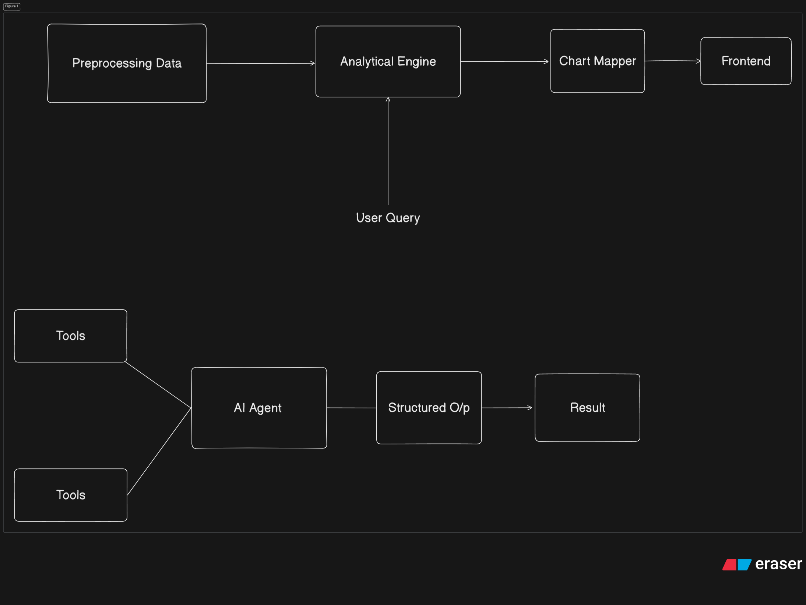

# Asset Vantage — AI Financial Analyst

Ask questions about a household's money in plain English, such as *"Am I financially healthy?"*. You get
an answer with charts. Built for the Asset Vantage hackathon:
**Ingest → Calculate → Detect → Score → Recommend**.



## How it works (in one minute)

```
You type a question
      │
      ▼
Supervisor agent (Gemini) ── decides which specialists to ask
      │
      ├── Financial Agent ........ cash flow, spending, assets, loans, net worth, forecast
      ├── Anomaly Agent .......... unusual transactions, spikes, data problems
      └── Recommendation Agent ... health score, what to do next, "what if" scenarios
                │
                ▼
      Python analytics (pandas) ── calculates every number from the CSV files
                │
                ▼
Supervisor writes a short answer and picks charts ──► React website shows them
```

**The golden rule:** the AI never calculates or types numbers. It only chooses which calculation to run.
Python does the maths, so the numbers are always correct.

---

## Setup (first time only)

You need **Python 3.10+** and **Node.js 18+** installed.

**1. Install the Python packages** (run in the `AssetV` folder):

```bash
pip install -r requirements.txt
```

**2. Add your Gemini API key.** Copy `.env.example` to a new file called `.env`, then put your key after
`GEMINI_API_KEY=` (no quotes, no spaces). Get a key at https://aistudio.google.com/apikey.

```
GEMINI_API_KEY=AIzaSy...your-key...
```

> Keep `.env` private. It is listed in `.gitignore`, so git will not upload it.

**3. Build the website** (run in the `frontend` folder):

```bash
cd frontend
npm install
npm run build
cd ..
```

## Run it

```bash
python -m uvicorn backend.main:app --port 8000
```

Open **http://localhost:8000** and click one of the example questions.

If the sidebar says *"AI not connected"*, your key is missing or wrong. Fix `.env`, then stop the server
(Ctrl+C) and start it again.

### Changing the website? Use dev mode

Building after every change is slow. Instead, run two terminals:

```bash
# terminal 1 — the Python API
python -m uvicorn backend.main:app --port 8000 --reload
```

```bash
# terminal 2 — the React site with instant reload
cd frontend
npm run dev
```

Then open **http://localhost:5173**. Edits to `frontend/src` show up immediately.

---

## Project map — where to change what

| I want to… | Edit this file |
|---|---|
| Change colours, spacing, fonts | `frontend/src/styles.css` |
| Change the example questions | `frontend/src/components/Chat.jsx` (`EXAMPLE_QUESTIONS`) |
| Change the sidebar | `frontend/src/components/Sidebar.jsx` |
| Change how a chart looks | `frontend/src/components/ChartView.jsx` |
| Change what the AI agents are told | `backend/agent/agent.py` (the `..._PROMPT` texts) |
| Add a new calculation | `backend/analytics/engine.py`, then register it in `backend/agent/tools.py` |
| Change how a calculation becomes a chart | `backend/analytics/charts.py` |
| Change how the raw data is cleaned | `backend/data/loader.py` |

```
AssetV/
├── .env                  your API key (you create this)
├── dataset/              the 3 CSV files
├── backend/              Python
│   ├── main.py           web server: /api/chat, /api/overview, /api/rechart
│   ├── data/loader.py    reads + cleans the CSVs
│   ├── analytics/
│   │   ├── engine.py     all the financial maths (16 functions)
│   │   ├── charts.py     turns results into chart descriptions
│   │   └── periods.py    understands "last_6_months", "FY2025-26", ...
│   └── agent/
│       ├── agent.py      the supervisor + 3 specialist agents (Gemini)
│       └── tools.py      the list of functions the AI is allowed to call
└── frontend/             React website
    └── src/
        ├── App.jsx       page layout
        ├── api.js        talks to the Python server
        ├── format.js     ₹ formatting + colours
        └── components/   Sidebar, Chat, Message, ChartCard, ChartView
```

### Adding a new question type (example)

1. Write a function in `backend/analytics/engine.py` that returns a dict of numbers.
2. Describe it in `backend/agent/tools.py` with `_tool("my_function", "what it does", {...params})`.
3. Add its name to one specialist's `"tools"` list in `backend/agent/agent.py`.
4. (Optional) Add a chart for it in `backend/analytics/charts.py`.

The AI picks up the new function on the next restart.

---

## Keeping AI costs low

Every answer shows a line such as *"Used 4,900 AI tokens in 5 model calls"*. These choices keep that
number small:

- **Few model calls:** the supervisor makes 2 calls per question (plan, then answer), and each specialist
  makes exactly 1.
- **Charts cost no extra calls:** the supervisor writes `[[chart r3 line]]` in its answer, and the server
  draws the chart from data it already has.
- **Compact data:** results are sent to the AI as compact tables, about half the size of plain JSON.
  Big data such as a 12×14 heatmap is summarised.
- **Short instructions and memory:** function descriptions are kept short, and only the last 4 questions
  are remembered (`GEMINI_HISTORY_TURNS`).
- **Thinking off for specialists:** `GEMINI_WORKER_THINKING_BUDGET=0`.
- **Free chart switching:** the chart-type dropdown re-draws a chart without calling the AI. The sidebar
  numbers don't use the AI either.

---

## The data and what we fixed

The CSVs contain deliberate mistakes. `backend/data/loader.py` finds all 12 and logs them. Ask the bot
*"What was wrong with the raw data?"* to see the list.

| Problem | Row | What we did |
|---|---|---|
| Same row twice | T0410 | removed |
| Two different rows with the same ID | T0031, T0760 | renamed the second to `-B` |
| Date written as `2026/06/15` | T0643 | fixed the format |
| Missing description / category | T0138 / T0702 | "Unspecified" / guessed from description |
| Car-loan EMI filed under "Foods" | T0202 | moved to Debt Payment |
| Negative EMI (-₹4,500) | T0089 | left out of the numbers |
| ₹0 EMI | T0343 | kept, flagged as a possible missed payment |
| Date in the future (Nov 2026) | T0277 | left out |
| Salary "correction" recorded as an expense | T0556 | left out |
| ₹1,85,000 mobile bill (206× normal) | T0488 | left out as a typo |

### Health score (0–100)

| Check | Points | Full points when |
|---|---|---|
| Savings rate | 25 | you save ≥ 30% of income |
| Loan EMIs ÷ income | 20 | ≤ 20% |
| Emergency fund | 20 | cash covers ≥ 6 months of spending |
| Debt ÷ assets | 15 | ≤ 30% |
| Expensive debt | 10 | no loans above 15% interest |
| Spending discipline | 10 | spending is not growing |

This household scores **79/100 (Good)**.

## Demo script

1. "Am I financially healthy?"
2. "Why?"
3. "Show my income and expenses for the last 6 months and where I spend the most"
4. "Exclude my one-time expenses"
5. "Are there any unusual transactions?"
6. "What if I pay off my credit card and cut shopping by 30%?"
7. "What should I do next?"
